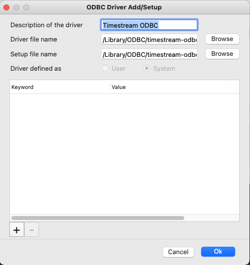
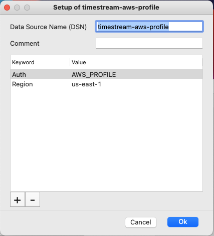

# Configuring a DSN on Mac

> NOTE: iODBC Administrator is included with the [iODBC Driver Manager](http://www.iodbc.org/dataspace/doc/iodbc/wiki/iodbcWiki/Downloads), which must be installed in order to use the driver on Mac.

1. Open **iODBC Administrator** using the following command (this gives the application permissions to save the Driver & DSN configurations):
	1. `sudo /Applications/iODBC/iODBC\ Administrator64.app/Contents/MacOS/iODBC\ Administrator64`

## Adding a Driver Entry

1. Go to the **ODBC Drivers** tab.
2. Click **Add a Driver**.
	* **Description of the Driver**: The driver name used for ODBC connections (ex. `Amazon Timestream ODBC Driver`)
	* **Driver File Name**: The path to the driver file (default installed path: `/Library/ODBC/timestream-odbc/bin/libodfesqlodbc.dylib`)
	* **Setup File Name**: The path to the driver file (default installed path: `/Library/ODBC/timestream-odbc/bin/libodfesqlodbc.dylib`)
	* Set as a **User** driver
    * Below is a screenshot of how the final screen should look.
3. Click **OK** to save the options.

<p align="center"> 

</p>

## Adding a DSN Entry


1. Go to the **User DSN** tab
2. Select **Add** on the right side of the window.
	* Choose the Driver you added above.
	* **Data Source Name (DSN)**: The name of the DSN used to store connection options (ex. `AWS Timestream ODBC DSN`)
	* **Comment**: Not required
	* Add key-value pairs by using the **'+'** button. Below is a picture of the recommended set of options for a default local Open Distro for Elasticsearch installation.
3. Click **OK** to save the DSN configuration.

<p align="center"> 

</p>


## Troubleshooting

### iODBC Administrator: “General installer error” when saving new ODBC Driver

Try the following:

1. Create the folder `~/Library/ODBC`, then try again
2. Create two files in `~/Library/ODBC`, then open iODBC **Administrator** and verify the contents of **odbcinst.ini** and **odbc.ini** align with the format below.
	* **odbcinst.ini** (will be found in **ODBC Drivers**)
	```ini
    [ODBC Drivers]
    <Driver Name> = Installed
      
    [<Driver Name>]
    Driver = <odbc-root>/lib/libodfesqlodbc.dylib
    Setup = <odbc-root>/lib/libodfesqlodbc.dylib
	```
   * **odbc.ini** (will be found in **User DSNs**)
	```ini
	[ODBC Data Sources]  
    <DSN Name> = <Driver Name>
    
    [<DSN Name>]
    Driver = <odbc-root>/lib/libodfesqlodbc.dylib
    Auth = AWS_PROFILE
    UID = 
    PWD = 
    Region = us-east-1
    ConnectionTimeout = 1000
    RequestTimeout = 3000
    MaxConnections = 25
    LogLevel = 3
    LogOutput = /tmp/
	```
