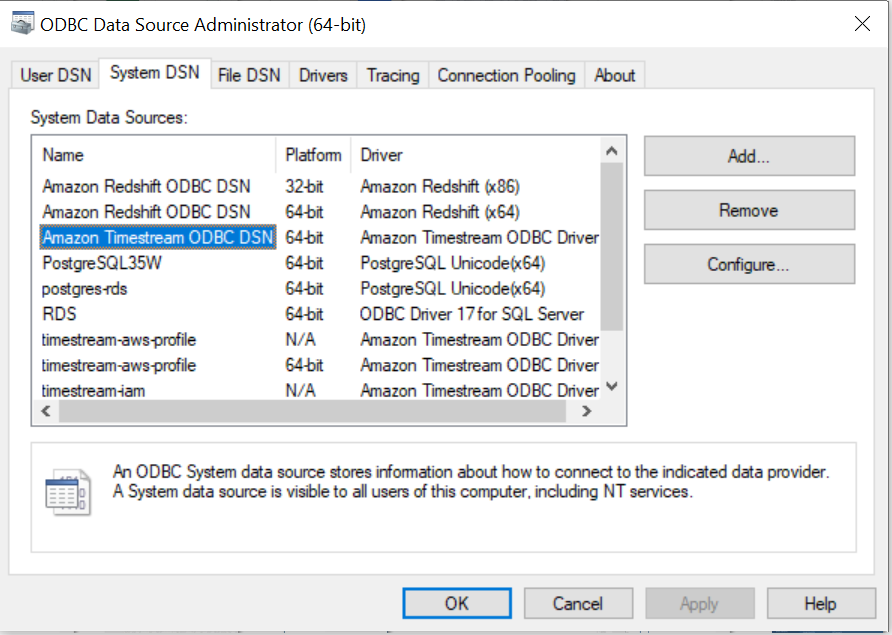
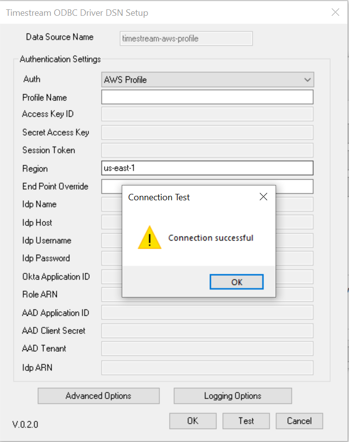
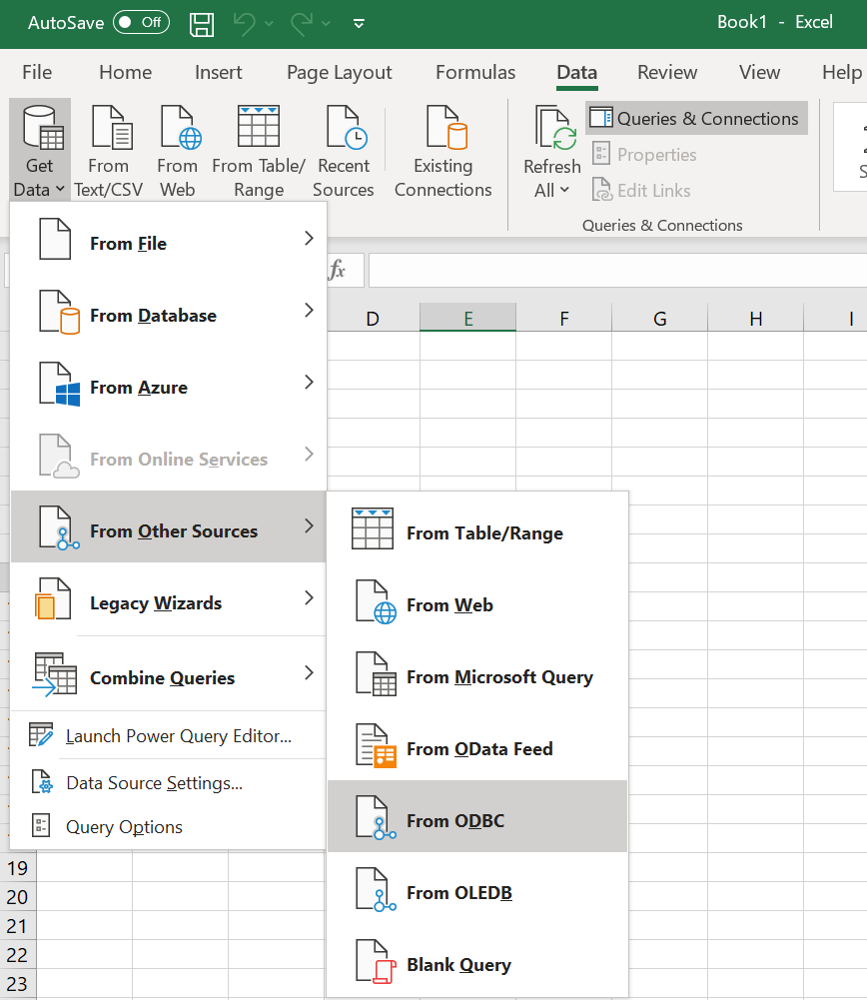
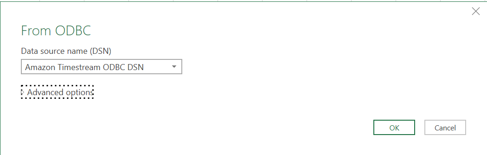
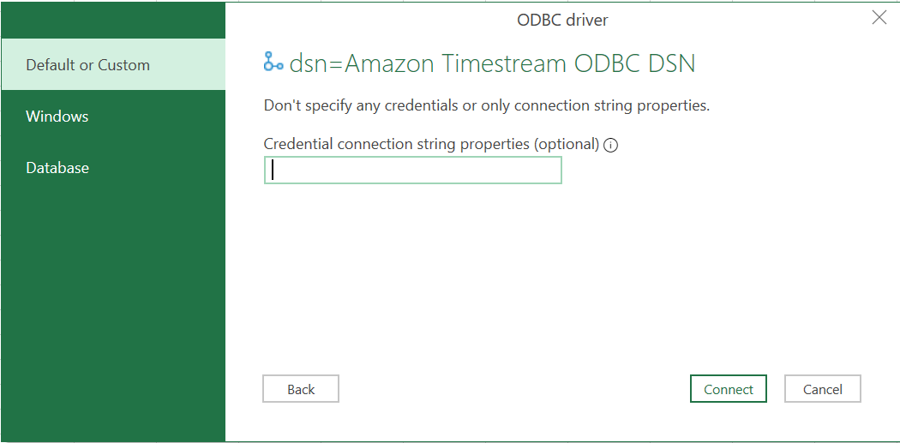
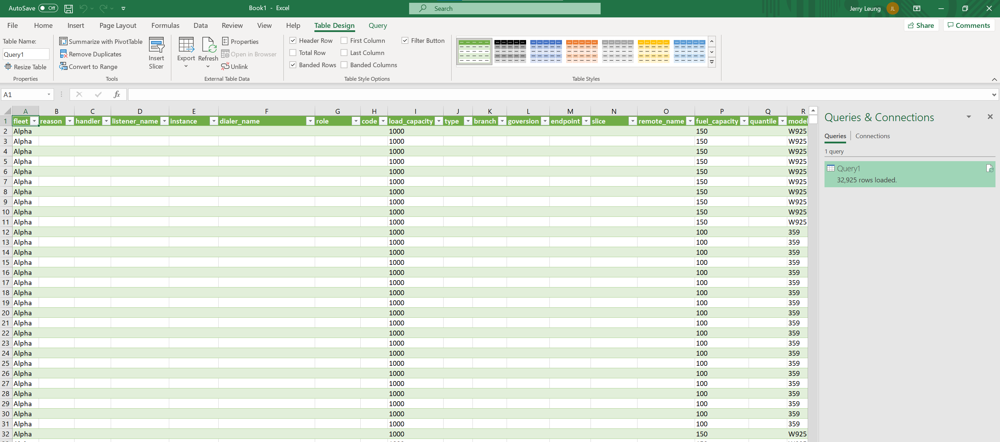
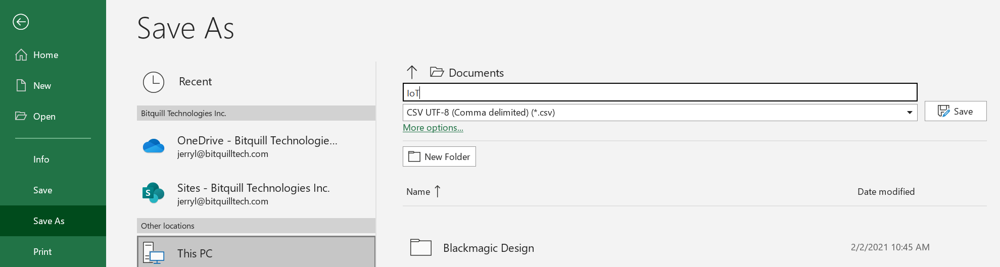

#  Connecting AWS Timestream to Microsoft Excel on Windows

## Prerequisites

* Microsoft Excel 2016 and higher
* [Amazon Timestream](https://aws.amazon.com/timestream/)
* [Amazon Timestream ODBC driver](https://opendistro.github.io/for-elasticsearch-docs/docs/sql/odbc/)
* A preconfigured [User or System DSN](../../README.md)

## Test Successful Connection

* Open **ODBC Data Source Administrator**.
* Click on **System DSN**.
* Select **Amazon Timestream ODBC DSN**.
* Click on **Configure**.

* Modify connection attributes accordingly.
* Click on **Test**.

* You should get a message as **Connection Successful**.

## Load data 

* Open blank workbook in Microsoft Excel.
* Click on **Data** > **Get Data** > **From Other Sources** > **From ODBC**

* Select **Amazon Timestream ODBC DSN**. Click **OK**.

* Expand **Advanced options** and type the query statement

* Select **Default or Custom** in connection credentials windows and click on **Connect**.

* Select a table from list to load data preview. Click on **Load**.

* Data will be loaded in the spreadsheet.

## Refresh Data

To refresh the data click on **Query** > **Refresh**.

Alternately, **Data** > **Refresh** option can also be used to refresh the data.

## Export as CSV files

* Click on **File** > **Save As**.
* Select Location to Save file.
* Type the file name.
* Set type as **CSV UTF-8(Comma delimited)(*.csv)**.

* Click **Save**.
* Data will be exported to selected location in CSV format.

## Troubleshooting

* There is a known issue when loading large amounts of data without using Advanced Options. The performance can be very slow or sometimes crash after several minutes. We recommend always using Advanced options to enter the query statement explicitly to load the data. For example, "SELECT * from ODBCTest.IoT
