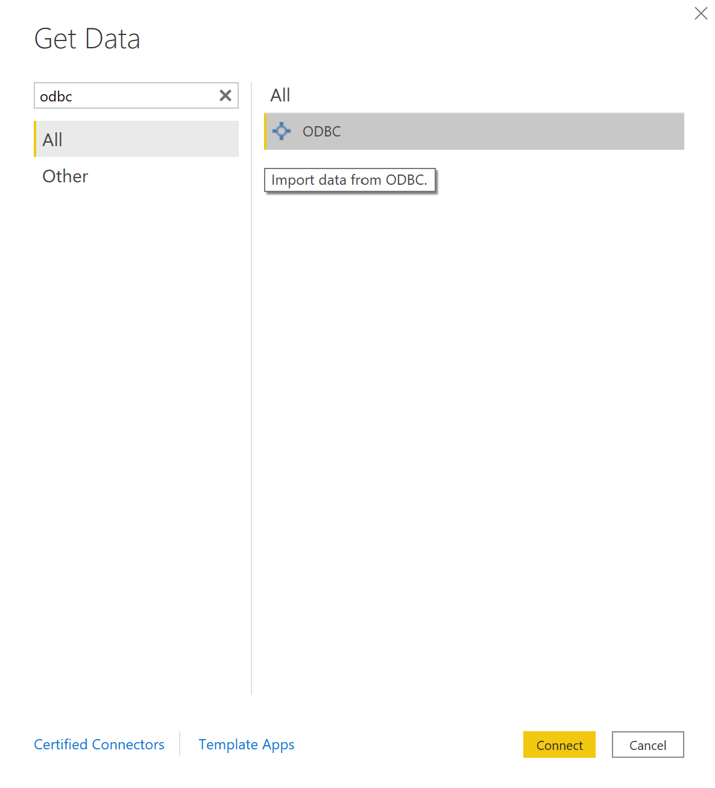
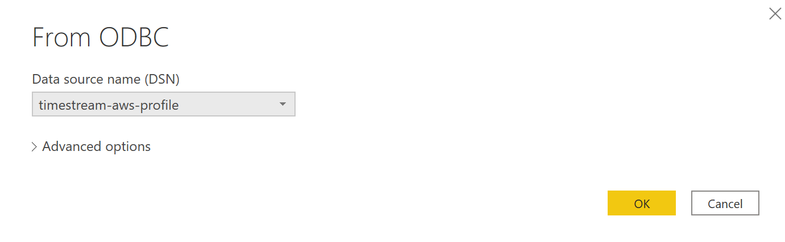
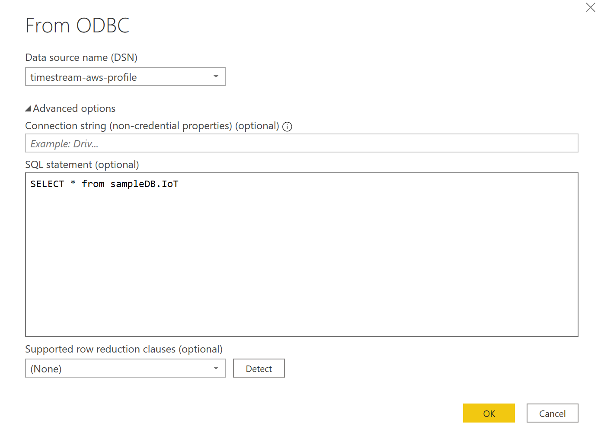
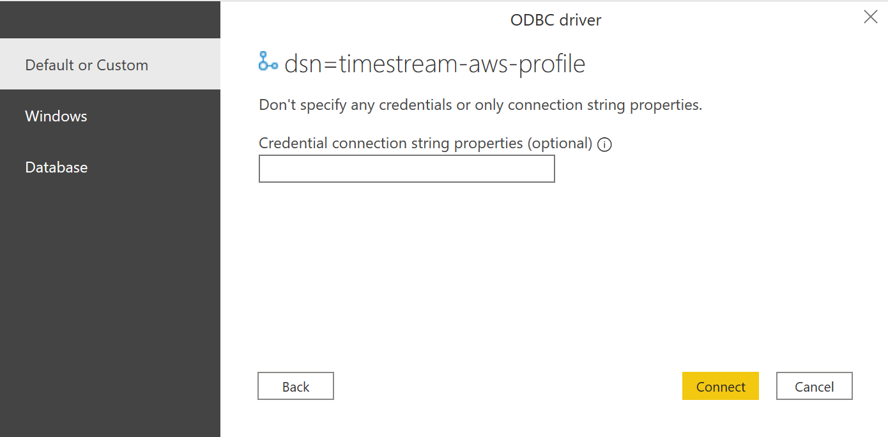
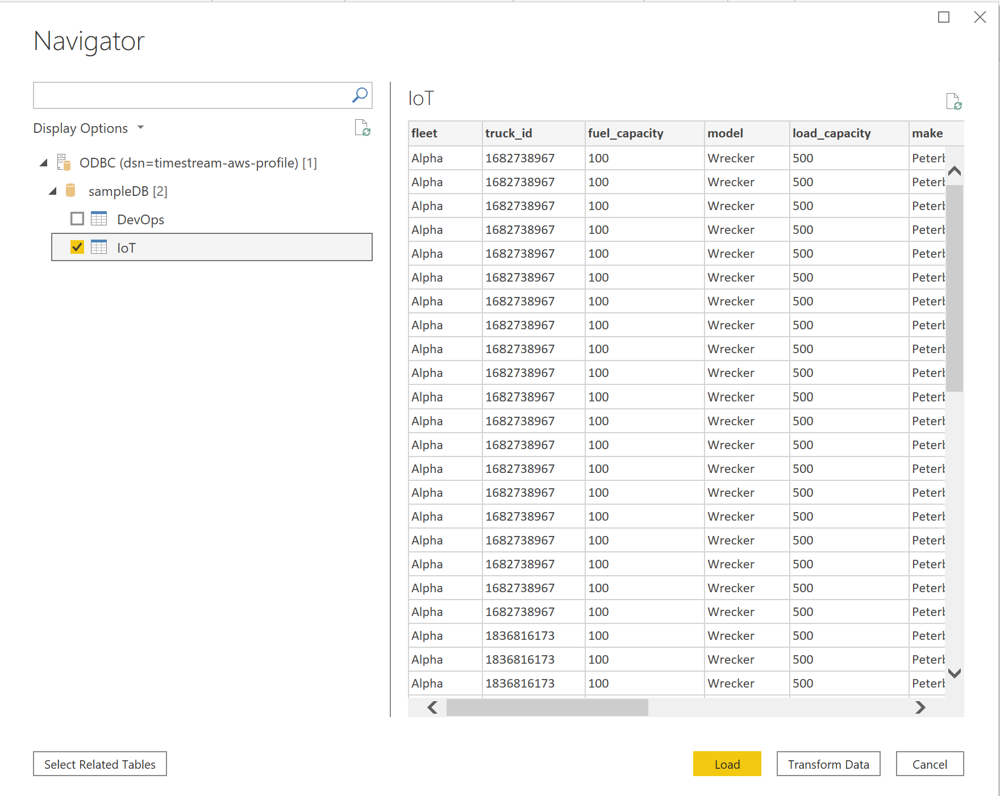
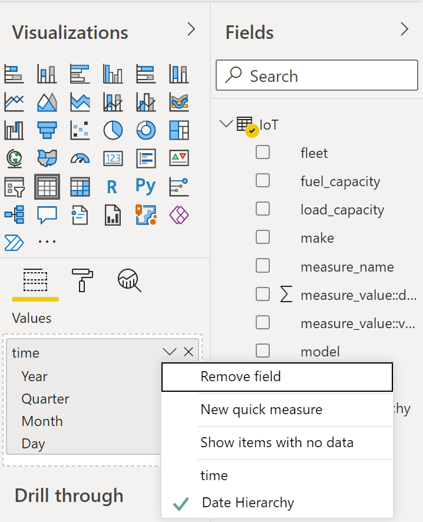

# Microsoft Power BI Desktop - Connecting to a Timestream ODBC data source

## Prerequisites
Before you get started, [configure the Timestream ODBC driver DSN](./windows_configure_dsn.md) using the Windows ODBC Data Source Administrator. 

## Connecting to an ODBC data source

1. Select `ODBC` from `Get Data` and click `Connect'.

2. Select the DSN from the `Data source name (DSN)` drop-down box (e.g. timestream-aws-profile) and click `OK`.

   **Note:** If you are using a very large dataset, importing all of the data may take a long time. You may want to use `Advanced options` to enter a query to limit the results. For example `SELECT * FROM sampleDB.IoT LIMIT 10000`.

3. If this is the first time connecting to this DSN, select the authentication type and input your credentials when prompted. The authentication types available are:

    * Default or Custom: Select this authentication type when you don't specify any credentials when the DSN is configured with a username and password.
    * Windows: Select this authentication type if you want to connect using Windows authentication.
    * Database: Select this authentication type to use a username and password to access a data source with an ODBC driver. This is the default selection.

   Once you are done, click `Connect`.

4. In the Navigator, select the database tables you want, then either select `Load` to load the data or `Transform Data` to continue transforming the data.

**Notes:**

* All date/time fields are rounded to the nearest second when imported.

* By default, dates are displayed as a date hierarchy (Year, Quarter, Month, Day). To change the display, under `Visualizations` click `v` next to the field and select `time` instead of `Date Hierarchy`.

* Your Data Source Settings are saved once you connect. To modify them, select **Transform Data** > **Data Source Settings**.
