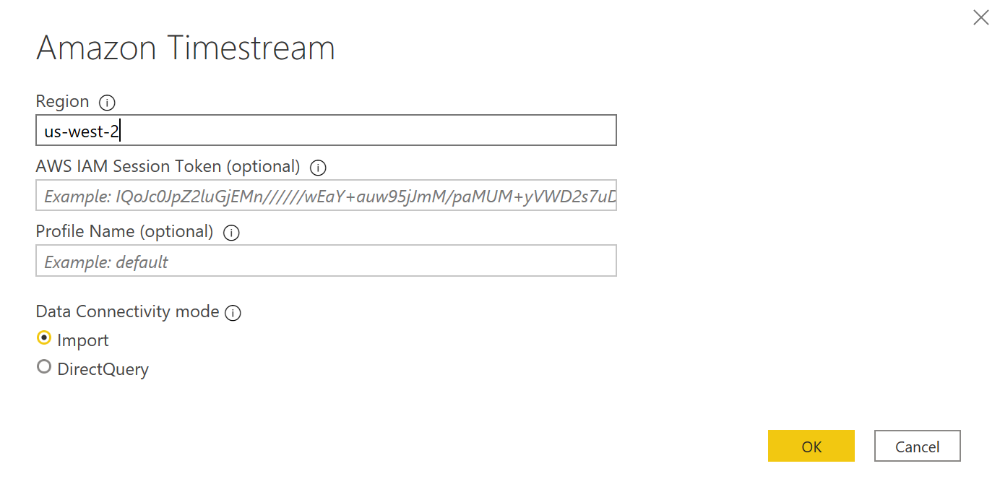

# Microsoft Power BI Desktop - Using Direct Query Mode with the Timestream Custom Connector

The custom connector only supports `AWS Profile` and `AWS IAM Credentials` authentication. Azure Active Directory and Okta authentication are not supported at this time.

Direct Query mode does not load data, but does live queries on the data. This means that data does not need to be refreshed and reloaded in order to show data updates. [Custom Connector - Import Mode vs Direct Query Mode](https://social.technet.microsoft.com/wiki/contents/articles/53078.power-bi-import-mode-vs-directquery-mode.aspx)

## Prerequisites
Before you get started, make sure you've properly installed the Timestream ODBC driver. 

Copy the `Timestream.mez` file to the `<User>\Documents\Power BI Desktop\Custom Connectors\` folder (or to `<User>\OneDrive\Documents\Power BI Desktop\Custom Connectors` if using OneDrive). This will let Power BI access custom connector.

From Power BI Desktop, change the settings to allow Power BI to use custom connectors.
* Open Power BI Desktop.
* Change the security settings. Click on Files > Options and settings > Options > Security > Select Allow any extension to load without validation or warning for Data Extensions. This will allow the custom connector to load data into Power BI.

* Restart Power BI Desktop.

**Note:** The Timestream custom connector only supports `AWS Profile` and `AWS IAM Credentials` authentication. Azure Active Directory and Okta authentication are not supported at this time.

## Connecting using the Timestream custom connector

1. Select `Timestream (Beta)` from `Get Data` and click `Connect'. You may get a warning for using third-party service. Click on `Continue`.

2. Enter the region. To connect using `AWS Profile` authentication, optionally enter the `Profile Name`. To connect using `AWS IAM Credentials` authentication, optionally enter the `AWS IAM Session Token` for multi-factor authentication. Click `OK`.

3. If this is the first time connecting to this data source, select the authentication type and input your credentials when prompted. The authentication types available are:

    * AWS Profile: If not using the default profile, you should enter the `Profile Name` on the previous screen.
    * AWS IAM Credentials: If using multi-factor authentication, you may need to enter the `AWS IAM Session Token` on the previous screen.
    
   Once you are done, click `Connect`.

4. In the Navigator, select the database tables you want, then either select `Load` to load the data or `Transform Data` to continue transforming the data.

**Notes:**

* All date/time fields are displayed to the nearest second but milliseconds still exist in the data. `Basic filtering` will look for exact matches so items with milliseconds will fail. Used `Advanced filtering`, `Relative Date` or `Relative Time` filtering instead.

* The actual time is correct if you use them in your measure/calculate columns.

* Your Data Source Settings are saved once you connect. To modify them, select **Transform Data** > **Data Source Settings**.

* If you are going to publish the reports to Power BI Gateway, you should use `AWS IAM Credentials` authentication as the gateway cannot access the .aws directory. If you are using multi-factor authentication, once the token expires, you will need to update the token in Power BI Desktop and re-publish any reports. You will also need to delete and re-add the data source with the new token in Power BI Gateway.
