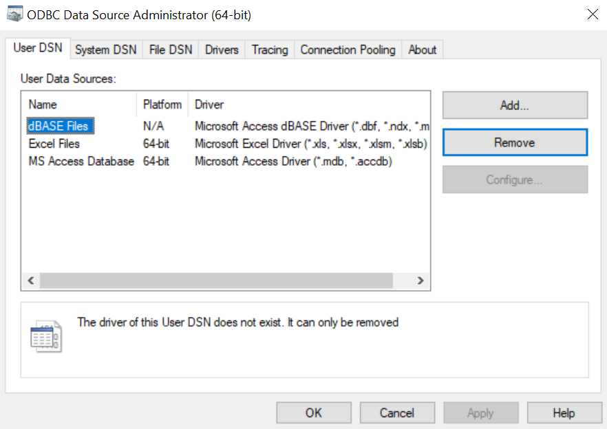
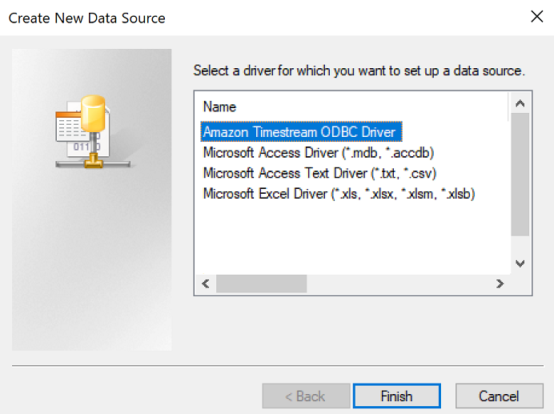
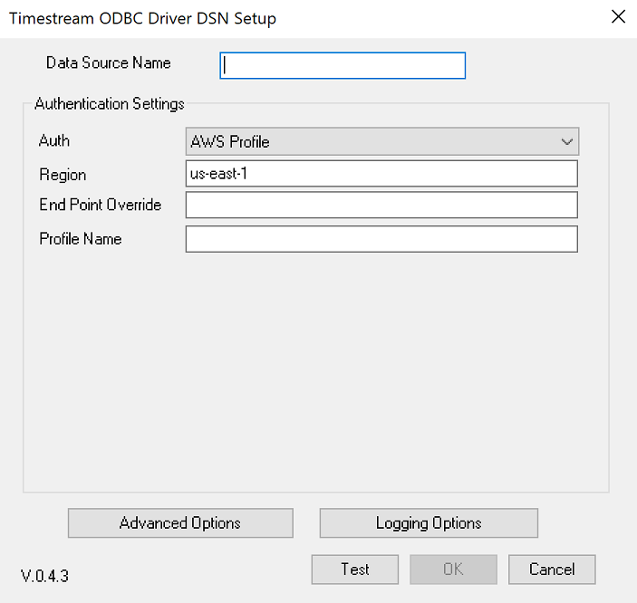
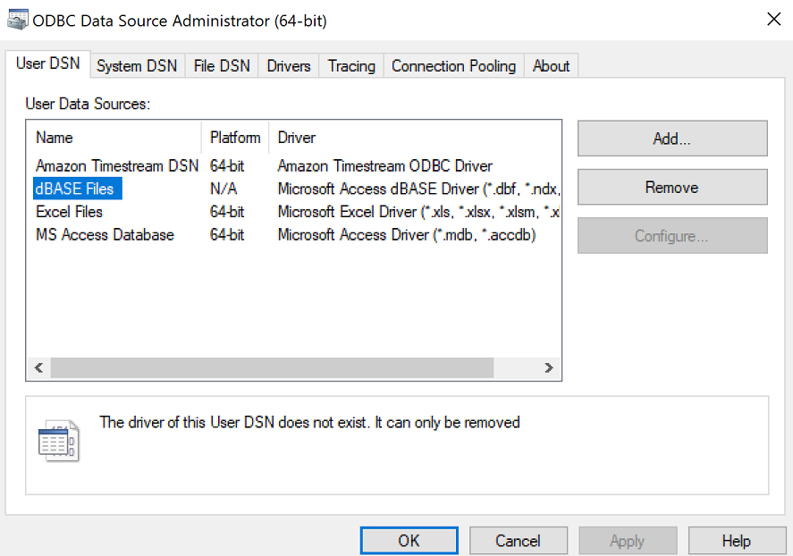

# Windows - Configuring a DSN

## Add DSN

1. Run `ODBC Data Sources (64-bit)` or `ODBC Data Sources (32-bit)`. Click on the `System DSN` or `User DSN` tab then click `Add...`.

 

2. Select `Amazon Timestream ODBC Driver` and click on `Finish`.

3. The DSN Setup window will open.

 

4. Update the values of the configuration options. See [Configuration Options](./configuration_options.md) for more details.
5. Click `Test` to verify connectivity; you will get a `Connection successful` message if your configuration is correct.
6. Click `OK` to save the DSN values. 
7. You will find this newly added DSN in the `System DSN` or `User DSN` list.

 
