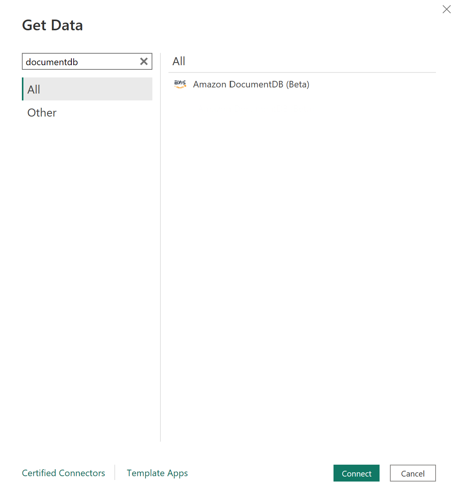
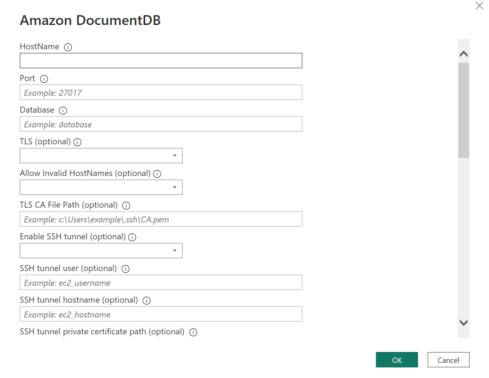
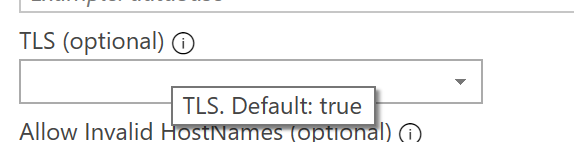
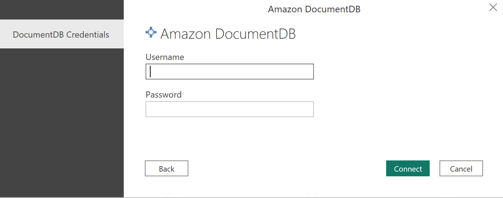
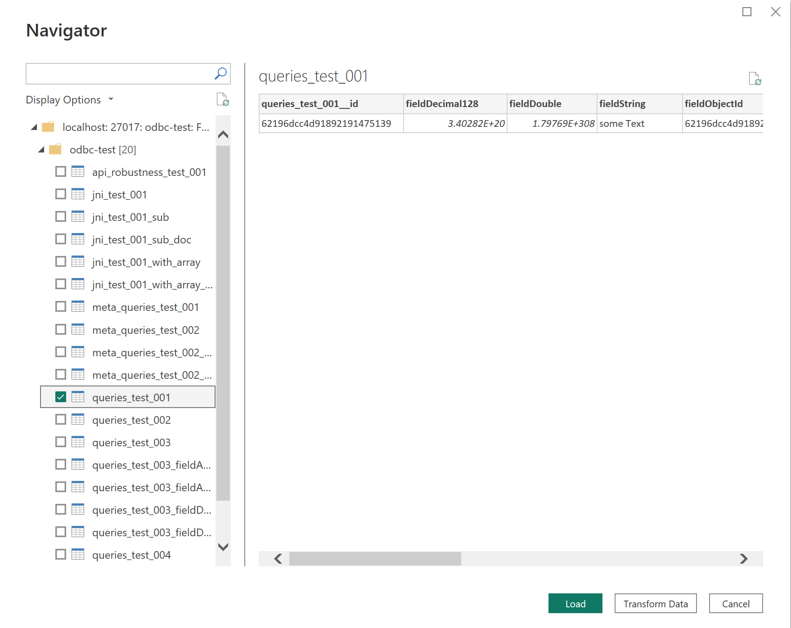

# Microsoft Power BI Desktop - Using Import Mode with the Amazon DocumentDB Custom Connector

The custom connector only supports DocumentDB username and password for authentication.

## Prerequisites
Before you get started, make sure the Amazon DocumentDB ODBC driver is installed properly. 

Follow these [instructions](https://learn.microsoft.com/en-us/power-bi/connect-data/desktop-connector-extensibility) to enable custom connector on Power BI.

Copy the `AmazonDocumentDBConnector.mez` file to the `<User>\Documents\Power BI Desktop\Custom Connectors\` folder (or to `<User>\OneDrive\Documents\Power BI Desktop\Custom Connectors` if using OneDrive). This will let Power BI access custom connector.

* Restart Power BI Desktop.

## Connecting using the Amazon DocumentDB custom connector

1. Select `Amazon DocumentDB (Beta)` from `Get Data` and click `Connect`. You may get a warning for using third-party service. Click on `Continue`.

2. Enter all necessary information to connect to your DocumentDB cluster.

   **Note** Hover on the info button to see what is the default value if the attribute is not provided.
   
3. Choose between Import Mode or Direct Query 
   **Note:**  Import mode loads all data and stores the information on disk. The data must be refreshed and reloaded in order to show data updates. Direct Query mode does not load data, but does live queries on the data. This means that data does not need to be refreshed and reloaded in order to show data updates. [Custom Connector - Import Mode vs Direct Query Mode](https://social.technet.microsoft.com/wiki/contents/articles/53078.power-bi-import-mode-vs-directquery-mode.aspx)

   **Note:** If you are using a very large dataset, importing all of the data may take a long time.

4. If this is the first time connecting to this data source, select the authentication type and input your credentials when prompted. The authentication types available are:

    * DocumentDB Credentials: Enter DocumentDB username and password.

   Once you are done, click `Connect`.

5. In the Navigator, select the database tables you want, then either select `Load` to load the data or `Transform Data` to continue transforming the data.

**Notes:**

* Your Data Source Settings are saved once you connect. To modify them, select **Transform Data** > **Data Source Settings**.
