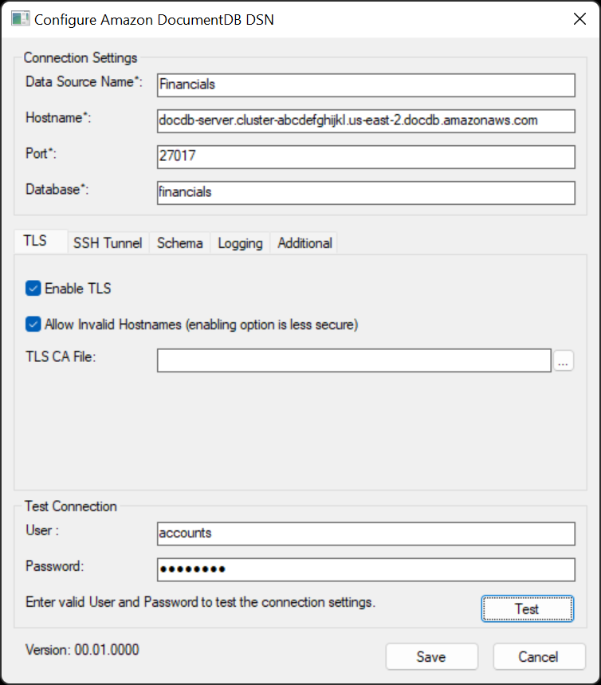

# Amazon DocumentDB ODBC Driver Setup

1. Open ODBC Driver Data Source Administrator (choose the proper bitness: 32 or 64)
    
2. Click on Add a new DSN.
3. Choose Amazon DocumentDB.
4. Fill the Windows Form properly. See [Connection String Syntax and Options](https://github.com/aws/amazon-documentdb-jdbc-driver/blob/develop/src/markdown/setup/connection-string.md#connection-string-syntax-and-options) for more information about each property. Note: **User** and **Password** are not written to the DSN settings. They must be provided by the BI tool or via the `SQLConnect` SDK API. 
    - TLS Tab:
    - 
    - SSH Tunnel Tab:
    - 
    - Schema Tab: 
    - 
    - Logging Tab:
    - 
    - Additional Tab:
    - 
    - Test Connection:
    - 