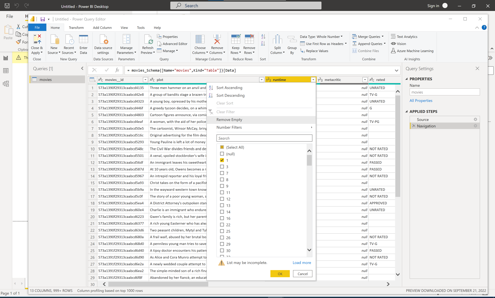
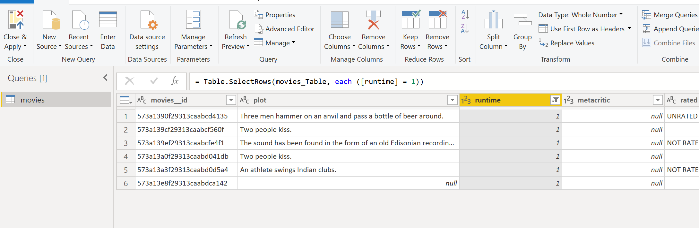
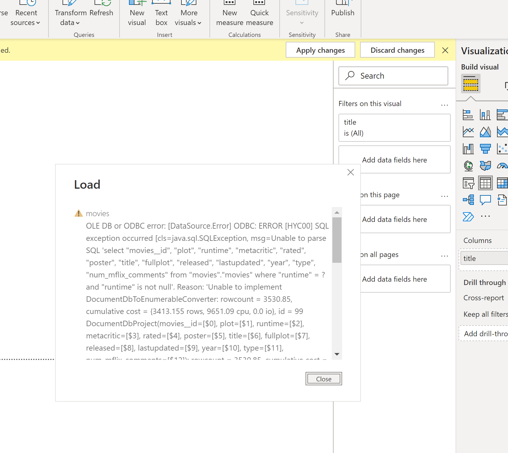

# ODBC Support and Limitations

## Supported Connection Information Types
| Connection Information Types | Default | Support Value Change|
|--------|------|-------|
| SQL_DRIVER_NAME | 'Amazon DocumentDB' | no |
| SQL_DBMS_NAME | 'Amazon DocumentDB' | no |
| SQL_DRIVER_ODBC_VER | '03.00' | no |
| SQL_DRIVER_VER | MM.mm.pppp (MM = major, mm = minor, pppp = patch) | no |
| SQL_DBMS_VER | MM.mm.pppp (MM = major, mm = minor, pppp = patch) | no |
| SQL_COLUMN_ALIAS | 'Y' | no |
| SQL_IDENTIFIER_QUOTE_CHAR | '\"' | no |
| SQL_CATALOG_NAME_SEPARATOR | '.' | no |
| SQL_SPECIAL_CHARACTERS | '' | no |
| SQL_CATALOG_TERM | '' | no |
| SQL_QUALIFIER_TERM | '' | no |
| SQL_TABLE_TERM | 'table' | no |
| SQL_SCHEMA_TERM | 'schema' | no |
| SQL_NEED_LONG_DATA_LEN | 'Y' | no |
| SQL_ACCESSIBLE_PROCEDURES | 'Y' | no |
| SQL_ACCESSIBLE_TABLES | 'Y' | no |
| SQL_CATALOG_NAME | 'N' | no |
| SQL_COLLATION_SEQ | 'UTF-8' | no |
| SQL_DATA_SOURCE_NAME | '\<dsn\>" (if available) | no |
| SQL_DATA_SOURCE_READ_ONLY | 'Y' | no |
| SQL_DATABASE_NAME | '\<database\>' | no |
| SQL_DESCRIBE_PARAMETER | 'N' | no |
| SQL_EXPRESSIONS_IN_ORDERBY | 'Y' | no |
| SQL_INTEGRITY | 'N' | no |
| SQL_KEYWORDS | 'ABS,ALLOW,ARRAY,ARRAY_MAX_CARDINALITY,ASYMMETRIC,ATOMIC,BEGIN_FRAME,BEGIN_PARTITION,BIGINT,BINARY,BLOB,BOOLEAN,CALL,CALLED,CARDINALITY,CEIL,CEILING,CHAR_LENGTH,CLASSIFIER,CLOB,COLLECT,CONDITION,CORR,COVAR_POP,COVAR_SAMP,CUBE,CUME_DIST,CURRENT_CATALOG,CURRENT_DEFAULT_TRANSFORM_GROUP,CURRENT_PATH,CURRENT_ROLE,CURRENT_ROW,CURRENT_SCHEMA,CURRENT_TRANSFORM_GROUP_FOR_TYPE,CYCLE,DENSE_RANK,DEREF,DETERMINISTIC,DISALLOW,DYNAMIC,EACH,ELEMENT,EMPTY,END_FRAME,END_PARTITION,EQUALS,EVERY,EXP,EXPLAIN,EXTEND,FILTER,FIRST_VALUE,FLOOR,FRAME_ROW,FREE,FUNCTION,FUSION,GROUPING,GROUPS,HOLD,IMPORT,INITIAL,INOUT,INTERSECTION,JSON_ARRAY,JSON_ARRAYAGG,JSON_EXISTS,JSON_OBJECT,JSON_OBJECTAGG,JSON_QUERY,JSON_VALUE,LAG,LARGE,LAST_VALUE,LATERAL,LEAD,LIKE_REGEX,LIMIT,LN,LOCALTIME,LOCALTIMESTAMP,MATCHES,MATCH_NUMBER,MATCH_RECOGNIZE,MEASURES,MEMBER,MERGE,METHOD,MINUS,MOD,MODIFIES,MULTISET,NCLOB,NEW,NORMALIZE,NTH_VALUE,NTILE,OCCURRENCES_REGEX,OFFSET,OLD,OMIT,ONE,OUT,OVER,OVERLAY,PARAMETER,PARTITION,PATTERN,PER,PERCENT,PERCENTILE_CONT,PERCENTILE_DISC,PERCENT_RANK,PERIOD,PERMUTE,PORTION,POSITION_REGEX,POWER,PRECEDES,PREV,RANGE,RANK,READS,RECURSIVE,REF,REFERENCING,REGR_AVGX,REGR_AVGY,REGR_COUNT,REGR_INTERCEPT,REGR_R2,REGR_SLOPE,REGR_SXX,REGR_SXY,REGR_SYY,RELEASE,RESET,RESULT,RETURN,RETURNS,ROLLUP,ROW,ROW_NUMBER,RUNNING,SAVEPOINT,SCOPE,SEARCH,SEEK,SENSITIVE,SHOW,SIMILAR,SKIP,SPECIFIC,SPECIFICTYPE,SQLEXCEPTION,SQRT,START,STATIC,STDDEV_POP,STDDEV_SAMP,STREAM,SUBMULTISET,SUBSET,SUBSTRING_REGEX,SUCCEEDS,SYMMETRIC,SYSTEM,SYSTEM_TIME,TABLESAMPLE,TINYINT,TRANSLATE_REGEX,TREAT,TRIGGER,TRIM_ARRAY,TRUNCATE,UESCAPE,UNNEST,UPSERT,VALUE_OF,VARBINARY,VAR_POP,VAR_SAMP,VERSIONING,WIDTH_BUCKET,WINDOW,WITHIN,WITHOUT' | no |
| SQL_LIKE_ESCAPE_CLAUSE | 'N' | no |
| SQL_MAX_ROW_SIZE_INCLUDES_LONG | 'Y' | no |
| SQL_MULT_RESULT_SETS | 'N' | no |
| SQL_MULTIPLE_ACTIVE_TXN | 'Y' | no |
| SQL_ORDER_BY_COLUMNS_IN_SELECT | 'N' | no |
| SQL_PROCEDURE_TERM | 'stored procedure' | no |
| SQL_PROCEDURES | 'N' | no |
| SQL_ROW_UPDATES | 'N' | no |
| SQL_SEARCH_PATTERN_ESCAPE | '\\\\' | no |
| SQL_SERVER_NAME | 'Amazon DocumentDB' | no |
| SQL_USER_NAME | '\<user\>' | no |
| SQL_ASYNC_DBC_FUNCTIONS | SQL_ASYNC_DBC_NOT_CAPABLE | no |
| SQL_ASYNC_MODE | SQL_AM_NONE | no |
| SQL_ASYNC_NOTIFICATION | SQL_ASYNC_NOTIFICATION_NOT_CAPABLE | no |
| SQL_BATCH_ROW_COUNT | SQL_BRC_ROLLED_UP, SQL_BRC_EXPLICIT | no |
| SQL_BATCH_SUPPORT | 0 (not supported) | no |
| SQL_BOOKMARK_PERSISTENCE | 0 (not supported) | no |
| SQL_CATALOG_LOCATION | 0 (not supported) | no |
| SQL_QUALIFIER_LOCATION | 0 (not supported) | no |
| SQL_GETDATA_EXTENSIONS|SQL_GD_ANY_COLUMN, SQL_GD_ANY_ORDER, SQL_GD_BOUND | no |
| SQL_ODBC_INTERFACE_CONFORMANCE | SQL_OIC_CORE | no |
| SQL_SQL_CONFORMANCE | SQL_SC_SQL92_ENTRY | no |
| SQL_CATALOG_USAGE | 0 (not supported) | no |
| SQL_QUALIFIER_USAGE | 0 (not supported) | no |
| SQL_SCHEMA_USAGE | SQL_SU_DML_STATEMENTS, SQL_SU_TABLE_DEFINITION, SQL_SU_PRIVILEGE_DEFINITION, SQL_SU_INDEX_DEFINITION | no |
| SQL_AGGREGATE_FUNCTIONS | SQL_AF_AVG, SQL_AF_COUNT, SQL_AF_MAX, SQL_AF_MIN, SQL_AF_SUM, SQL_AF_DISTINCT, SQL_AF_ALL | no |
| SQL_NUMERIC_FUNCTIONS | SQL_FN_NUM_MOD | no |
| SQL_STRING_FUNCTIONS|SQL_FN_STR_CHAR_LENGTH, SQL_FN_STR_CONCAT, SQL_FN_STR_LEFT, SQL_FN_STR_LOCATE, SQL_FN_STR_CHARACTER_LENGTH, SQL_FN_STR_POSITION, SQL_FN_STR_RIGHT, SQL_FN_STR_SUBSTRING, SQL_FN_STR_LCASE, SQL_FN_STR_UCASE | no |
| SQL_TIMEDATE_FUNCTIONS|SQL_FN_TD_CURRENT_TIME, SQL_FN_TD_CURRENT_DATE, SQL_FN_TD_CURRENT_TIMESTAMP, SQL_FN_TD_EXTRACT, SQL_FN_TD_YEAR, SQL_FN_TD_QUARTER, SQL_FN_TD_MONTH, SQL_FN_TD_WEEK, SQL_FN_TD_DAYOFYEAR, SQL_FN_TD_DAYOFMONTH, SQL_FN_TD_DAYOFWEEK, SQL_FN_TD_HOUR, SQL_FN_TD_MINUTE, SQL_FN_TD_SECOND, SQL_FN_TD_DAYNAME, SQL_FN_TD_MONTHNAME | no |
| SQL_TIMEDATE_ADD_INTERVALS|SQL_FN_TSI_FRAC_SECOND, SQL_FN_TSI_SECOND, SQL_FN_TSI_MINUTE, SQL_FN_TSI_HOUR, SQL_FN_TSI_DAY, SQL_FN_TSI_WEEK, SQL_FN_TSI_MONTH, SQL_FN_TSI_QUARTER, SQL_FN_TSI_YEAR | no |
| SQL_TIMEDATE_DIFF_INTERVALS|SQL_FN_TSI_FRAC_SECOND, SQL_FN_TSI_SECOND, SQL_FN_TSI_MINUTE, SQL_FN_TSI_HOUR, SQL_FN_TSI_DAY, SQL_FN_TSI_WEEK, SQL_FN_TSI_MONTH, SQL_FN_TSI_QUARTER, SQL_FN_TSI_YEAR | no |
| SQL_DATETIME_LITERALS|SQL_DL_SQL92_DATE, SQL_DL_SQL92_TIME, SQL_DL_SQL92_TIMESTAMP | no |
| SQL_SYSTEM_FUNCTIONS|SQL_FN_SYS_USERNAME, SQL_FN_SYS_DBNAME, SQL_FN_SYS_IFNULL | no |
| SQL_CONVERT_FUNCTIONS | SQL_FN_CVT_CONVERT, SQL_FN_CVT_CAST | no |
| SQL_OJ_CAPABILITIES|SQL_OJ_LEFT, SQL_OJ_NOT_ORDERED, SQL_OJ_ALL_COMPARISON_OPS | no |
| SQL_POS_OPERATIONS | 0 (not supported) | no |
| SQL_SQL92_NUMERIC_VALUE_FUNCTIONS|SQL_SNVF_CHARACTER_LENGTH, SQL_SNVF_EXTRACT, SQL_SNVF_POSITION | no |
| SQL_SQL92_STRING_FUNCTIONS|SQL_SSF_LOWER, SQL_SSF_UPPER, SQL_SSF_SUBSTRING | no |
| SQL_SQL92_DATETIME_FUNCTIONS|SQL_SDF_CURRENT_DATE, SQL_SDF_CURRENT_TIMESTAMP | no |
| SQL_SQL92_VALUE_EXPRESSIONS|SQL_SVE_CASE, SQL_SVE_CAST, SQL_SVE_COALESCE, SQL_SVE_NULLIF | no |
| SQL_SQL92_PREDICATES|SQL_SP_BETWEEN, SQL_SP_COMPARISON, SQL_SP_EXISTS, SQL_SP_IN, SQL_SP_ISNOTNULL, SQL_SP_ISNULL, SQL_SP_LIKE, SQL_SP_MATCH_FULL, SQL_SP_MATCH_PARTIAL, SQL_SP_MATCH_UNIQUE_FULL, SQL_SP_MATCH_UNIQUE_PARTIAL, SQL_SP_OVERLAPS, SQL_SP_UNIQUE, SQL_SP_QUANTIFIED_COMPARISON | no |
| SQL_SQL92_RELATIONAL_JOIN_OPERATORS|SQL_SRJO_CORRESPONDING_CLAUSE, SQL_SRJO_CROSS_JOIN, SQL_SRJO_EXCEPT_JOIN, SQL_SRJO_INNER_JOIN, SQL_SRJO_LEFT_OUTER_JOIN, SQL_SRJO_RIGHT_OUTER_JOIN, SQL_SRJO_NATURAL_JOIN, SQL_SRJO_INTERSECT_JOIN, SQL_SRJO_UNION_JOIN | no |
| SQL_STATIC_CURSOR_ATTRIBUTES1 | SQL_CA1_NEXT | no |
| SQL_STATIC_CURSOR_ATTRIBUTES2 | 0 (not supported) | no |
| SQL_CONVERT_BIGINT|SQL_CVT_CHAR, SQL_CVT_VARCHAR, SQL_CVT_LONGVARCHAR, SQL_CVT_WCHAR, SQL_CVT_WLONGVARCHAR, SQL_CVT_WVARCHAR, SQL_CVT_NUMERIC, SQL_CVT_TIMESTAMP, SQL_CVT_TINYINT, SQL_CVT_SMALLINT, SQL_CVT_INTEGER, SQL_CVT_BIGINT, SQL_CVT_BIT | no |
| SQL_CONVERT_BINARY|SQL_CVT_CHAR, SQL_CVT_VARCHAR, SQL_CVT_LONGVARCHAR, SQL_CVT_BIT, SQL_CVT_WCHAR, SQL_CVT_WLONGVARCHAR, SQL_CVT_WVARCHAR, SQL_CVT_NUMERIC, SQL_CVT_LONGVARBINARY, SQL_CVT_FLOAT, SQL_CVT_SMALLINT, SQL_CVT_INTEGER, SQL_CVT_BIGINT, SQL_CVT_REAL, SQL_CVT_DATE, SQL_CVT_TINYINT, SQL_CVT_DOUBLE, SQL_CVT_BINARY, SQL_CVT_DECIMAL, SQL_CVT_TIME, SQL_CVT_GUID, SQL_CVT_TIMESTAMP, SQL_CVT_VARBINARY | no |
| SQL_CONVERT_BIT|SQL_CVT_BIGINT, SQL_CVT_VARCHAR, SQL_CVT_LONGVARCHAR, SQL_CVT_WVARCHAR, SQL_CVT_NUMERIC, SQL_CVT_BIT, SQL_CVT_CHAR, SQL_CVT_SMALLINT, SQL_CVT_INTEGER, SQL_CVT_TINYINT | no |
| SQL_CONVERT_CHAR|SQL_CVT_CHAR, SQL_CVT_VARCHAR, SQL_CVT_LONGVARCHAR, SQL_CVT_VARBINARY, SQL_CVT_WCHAR, SQL_CVT_WLONGVARCHAR, SQL_CVT_WVARCHAR, SQL_CVT_NUMERIC, SQL_CVT_DECIMAL, SQL_CVT_BIT, SQL_CVT_TINYINT, SQL_CVT_SMALLINT, SQL_CVT_INTEGER, SQL_CVT_BIGINT, SQL_CVT_REAL, SQL_CVT_FLOAT, SQL_CVT_DOUBLE, SQL_CVT_BINARY, SQL_CVT_TIMESTAMP, SQL_CVT_DATE, SQL_CVT_TIME, SQL_CVT_LONGVARBINARY, SQL_CVT_GUID | no |
| SQL_CONVERT_VARCHAR|SQL_CVT_CHAR, SQL_CVT_VARCHAR, SQL_CVT_LONGVARCHAR, SQL_CVT_WCHAR, SQL_CVT_WLONGVARCHAR, SQL_CVT_WVARCHAR, SQL_CVT_NUMERIC, SQL_CVT_DECIMAL, SQL_CVT_TINYINT, SQL_CVT_SMALLINT, SQL_CVT_INTEGER, SQL_CVT_BIGINT, SQL_CVT_REAL, SQL_CVT_FLOAT, SQL_CVT_BIT, SQL_CVT_DOUBLE, SQL_CVT_BINARY, SQL_CVT_VARBINARY, SQL_CVT_GUID, SQL_CVT_DATE, SQL_CVT_TIME, SQL_CVT_LONGVARBINARY, SQL_CVT_TIMESTAMP | no |
| SQL_CONVERT_LONGVARCHAR|SQL_CVT_CHAR, SQL_CVT_VARCHAR, SQL_CVT_DATE, SQL_CVT_TIME, SQL_CVT_LONGVARCHAR, SQL_CVT_WCHAR, SQL_CVT_WLONGVARCHAR, SQL_CVT_WVARCHAR, SQL_CVT_NUMERIC, SQL_CVT_DECIMAL, SQL_CVT_BIT, SQL_CVT_REAL, SQL_CVT_SMALLINT, SQL_CVT_INTEGER, SQL_CVT_GUID, SQL_CVT_BIGINT, SQL_CVT_LONGVARBINARY, SQL_CVT_DOUBLE, SQL_CVT_BINARY, SQL_CVT_VARBINARY, SQL_CVT_TINYINT, SQL_CVT_FLOAT, SQL_CVT_TIMESTAMP | no |
| SQL_CONVERT_WCHAR|SQL_CVT_CHAR, SQL_CVT_VARCHAR, SQL_CVT_LONGVARCHAR, SQL_CVT_WCHAR, SQL_CVT_WLONGVARCHAR, SQL_CVT_WVARCHAR, SQL_CVT_NUMERIC, SQL_CVT_DECIMAL, SQL_CVT_VARBINARY, SQL_CVT_BIT, SQL_CVT_TINYINT, SQL_CVT_SMALLINT, SQL_CVT_INTEGER, SQL_CVT_BIGINT, SQL_CVT_REAL, SQL_CVT_FLOAT, SQL_CVT_DOUBLE, SQL_CVT_BINARY, SQL_CVT_LONGVARBINARY, SQL_CVT_TIMESTAMP, SQL_CVT_DATE, SQL_CVT_TIME, SQL_CVT_GUID | no |
| SQL_CONVERT_WVARCHAR|SQL_CVT_CHAR, SQL_CVT_VARCHAR, SQL_CVT_LONGVARCHAR, SQL_CVT_REAL, SQL_CVT_WCHAR, SQL_CVT_WLONGVARCHAR, SQL_CVT_WVARCHAR, SQL_CVT_NUMERIC, SQL_CVT_LONGVARBINARY, SQL_CVT_DECIMAL, SQL_CVT_BIT, SQL_CVT_TINYINT, SQL_CVT_SMALLINT, SQL_CVT_DATE, SQL_CVT_TIME, SQL_CVT_INTEGER, SQL_CVT_BIGINT, SQL_CVT_FLOAT, SQL_CVT_DOUBLE, SQL_CVT_BINARY, SQL_CVT_GUID, SQL_CVT_VARBINARY, SQL_CVT_TIMESTAMP | no |
| SQL_CONVERT_WLONGVARCHAR|SQL_CVT_CHAR, SQL_CVT_VARCHAR, SQL_CVT_BIGINT, SQL_CVT_REAL, SQL_CVT_LONGVARCHAR, SQL_CVT_WCHAR, SQL_CVT_WLONGVARCHAR, SQL_CVT_WVARCHAR, SQL_CVT_VARBINARY, SQL_CVT_NUMERIC, SQL_CVT_DECIMAL, SQL_CVT_BIT, SQL_CVT_TINYINT, SQL_CVT_DATE, SQL_CVT_FLOAT, SQL_CVT_INTEGER, SQL_CVT_SMALLINT, SQL_CVT_DOUBLE, SQL_CVT_BINARY, SQL_CVT_LONGVARBINARY, SQL_CVT_TIME, SQL_CVT_TIMESTAMP, SQL_CVT_GUID | no |
| SQL_CONVERT_GUID|SQL_CVT_CHAR, SQL_CVT_VARCHAR, SQL_CVT_LONGVARCHAR, SQL_CVT_WVARCHAR, SQL_CVT_WCHAR, SQL_CVT_WLONGVARCHAR, SQL_CVT_BINARY, SQL_CVT_VARBINARY, SQL_CVT_LONGVARBINARY, SQL_CVT_GUID | no |
| SQL_CONVERT_DATE|SQL_CVT_CHAR, SQL_CVT_VARCHAR, SQL_CVT_LONGVARCHAR, SQL_CVT_WCHAR, SQL_CVT_WLONGVARCHAR, SQL_CVT_WVARCHAR, SQL_CVT_NUMERIC, SQL_CVT_INTEGER, SQL_CVT_BIGINT, SQL_CVT_BINARY, SQL_CVT_VARBINARY, SQL_CVT_LONGVARBINARY, SQL_CVT_DATE, SQL_CVT_TIMESTAMP | no |
| SQL_CONVERT_DECIMAL|SQL_CVT_CHAR, SQL_CVT_VARCHAR, SQL_CVT_LONGVARCHAR, SQL_CVT_WCHAR, SQL_CVT_WLONGVARCHAR, SQL_CVT_WVARCHAR, SQL_CVT_NUMERIC, SQL_CVT_DECIMAL, SQL_CVT_TIMESTAMP, SQL_CVT_BIT, SQL_CVT_TINYINT, SQL_CVT_SMALLINT, SQL_CVT_INTEGER, SQL_CVT_BIGINT, SQL_CVT_REAL, SQL_CVT_FLOAT, SQL_CVT_DOUBLE, SQL_CVT_BINARY, SQL_CVT_VARBINARY, SQL_CVT_LONGVARBINARY | no |
| SQL_CONVERT_DOUBLE|SQL_CVT_CHAR, SQL_CVT_VARCHAR, SQL_CVT_LONGVARCHAR, SQL_CVT_WCHAR, SQL_CVT_WLONGVARCHAR, SQL_CVT_WVARCHAR, SQL_CVT_NUMERIC, SQL_CVT_DECIMAL, SQL_CVT_TIMESTAMP, SQL_CVT_TINYINT, SQL_CVT_BIGINT, SQL_CVT_INTEGER, SQL_CVT_FLOAT, SQL_CVT_REAL, SQL_CVT_DOUBLE, SQL_CVT_BINARY, SQL_CVT_VARBINARY, SQL_CVT_SMALLINT, SQL_CVT_LONGVARBINARY | no |
| SQL_CONVERT_FLOAT|SQL_CVT_CHAR, SQL_CVT_VARCHAR, SQL_CVT_LONGVARCHAR, SQL_CVT_WVARCHAR, SQL_CVT_WLONGVARCHAR, SQL_CVT_NUMERIC, SQL_CVT_DECIMAL, SQL_CVT_TINYINT, SQL_CVT_SMALLINT, SQL_CVT_INTEGER, SQL_CVT_BIGINT, SQL_CVT_REAL, SQL_CVT_FLOAT, SQL_CVT_DOUBLE, SQL_CVT_BINARY, SQL_CVT_VARBINARY, SQL_CVT_WCHAR, SQL_CVT_LONGVARBINARY, SQL_CVT_TIMESTAMP, SQL_CVT_BIT | no |
| SQL_CONVERT_REAL|SQL_CVT_CHAR, SQL_CVT_VARCHAR, SQL_CVT_LONGVARCHAR, SQL_CVT_WVARCHAR, SQL_CVT_NUMERIC, SQL_CVT_DECIMAL, SQL_CVT_BIT, SQL_CVT_FLOAT, SQL_CVT_SMALLINT, SQL_CVT_REAL, SQL_CVT_INTEGER, SQL_CVT_BIGINT, SQL_CVT_DOUBLE, SQL_CVT_TINYINT, SQL_CVT_WLONGVARCHAR, SQL_CVT_BINARY, SQL_CVT_VARBINARY, SQL_CVT_LONGVARBINARY, SQL_CVT_TIMESTAMP, SQL_CVT_WCHAR | no |
| SQL_CONVERT_INTEGER|SQL_CVT_CHAR, SQL_CVT_VARCHAR, SQL_CVT_LONGVARCHAR, SQL_CVT_WCHAR, SQL_CVT_WLONGVARCHAR, SQL_CVT_WVARCHAR, SQL_CVT_NUMERIC, SQL_CVT_DECIMAL, SQL_CVT_TINYINT, SQL_CVT_SMALLINT, SQL_CVT_BIT, SQL_CVT_INTEGER, SQL_CVT_BIGINT, SQL_CVT_REAL, SQL_CVT_FLOAT, SQL_CVT_DOUBLE, SQL_CVT_BINARY, SQL_CVT_VARBINARY, SQL_CVT_LONGVARBINARY, SQL_CVT_TIMESTAMP | no |
| SQL_CONVERT_NUMERIC|SQL_CVT_CHAR, SQL_CVT_VARCHAR, SQL_CVT_LONGVARCHAR, SQL_CVT_WCHAR, SQL_CVT_WLONGVARCHAR, SQL_CVT_WVARCHAR, SQL_CVT_NUMERIC, SQL_CVT_DECIMAL, SQL_CVT_SMALLINT, SQL_CVT_INTEGER, SQL_CVT_BIGINT, SQL_CVT_REAL, SQL_CVT_BIT, SQL_CVT_TINYINT, SQL_CVT_FLOAT, SQL_CVT_DOUBLE, SQL_CVT_BINARY, SQL_CVT_VARBINARY, SQL_CVT_LONGVARBINARY, SQL_CVT_TIMESTAMP | no |
| SQL_CONVERT_SMALLINT|SQL_CVT_CHAR, SQL_CVT_VARCHAR, SQL_CVT_LONGVARCHAR, SQL_CVT_WCHAR, SQL_CVT_WLONGVARCHAR, SQL_CVT_WVARCHAR, SQL_CVT_NUMERIC, SQL_CVT_DECIMAL, SQL_CVT_VARBINARY, SQL_CVT_BIT, SQL_CVT_TINYINT, SQL_CVT_SMALLINT, SQL_CVT_INTEGER, SQL_CVT_BIGINT, SQL_CVT_REAL, SQL_CVT_FLOAT, SQL_CVT_DOUBLE, SQL_CVT_BINARY, SQL_CVT_LONGVARBINARY, SQL_CVT_TIMESTAMP | no |
| SQL_CONVERT_TINYINT|SQL_CVT_CHAR, SQL_CVT_VARCHAR, SQL_CVT_LONGVARCHAR, SQL_CVT_WCHAR, SQL_CVT_WLONGVARCHAR, SQL_CVT_WVARCHAR, SQL_CVT_NUMERIC, SQL_CVT_DECIMAL, SQL_CVT_TINYINT, SQL_CVT_SMALLINT, SQL_CVT_BIT, SQL_CVT_INTEGER, SQL_CVT_BIGINT, SQL_CVT_REAL, SQL_CVT_FLOAT, SQL_CVT_DOUBLE, SQL_CVT_BINARY, SQL_CVT_VARBINARY, SQL_CVT_LONGVARBINARY, SQL_CVT_TIMESTAMP | no |
| SQL_CONVERT_TIME|SQL_CVT_CHAR, SQL_CVT_VARCHAR, SQL_CVT_LONGVARCHAR, SQL_CVT_WVARCHAR, SQL_CVT_WCHAR, SQL_CVT_WLONGVARCHAR, SQL_CVT_BINARY, SQL_CVT_VARBINARY, SQL_CVT_LONGVARBINARY, SQL_CVT_TIME, SQL_CVT_TIMESTAMP | no |
| SQL_CONVERT_TIMESTAMP|SQL_CVT_CHAR, SQL_CVT_VARCHAR, SQL_CVT_LONGVARCHAR, SQL_CVT_DATE, SQL_CVT_WCHAR, SQL_CVT_WLONGVARCHAR, SQL_CVT_WVARCHAR, SQL_CVT_NUMERIC, SQL_CVT_LONGVARBINARY, SQL_CVT_DECIMAL, SQL_CVT_INTEGER, SQL_CVT_BINARY, SQL_CVT_VARBINARY, SQL_CVT_TIMESTAMP, SQL_CVT_BIGINT, SQL_CVT_TIME | no |
| SQL_CONVERT_VARBINARY|SQL_CVT_CHAR, SQL_CVT_VARCHAR, SQL_CVT_LONGVARCHAR, SQL_CVT_BIT, SQL_CVT_WCHAR, SQL_CVT_WLONGVARCHAR, SQL_CVT_WVARCHAR, SQL_CVT_NUMERIC, SQL_CVT_DECIMAL, SQL_CVT_TINYINT, SQL_CVT_SMALLINT, SQL_CVT_DATE, SQL_CVT_BIGINT, SQL_CVT_REAL, SQL_CVT_FLOAT, SQL_CVT_DOUBLE, SQL_CVT_INTEGER, SQL_CVT_BINARY, SQL_CVT_VARBINARY, SQL_CVT_LONGVARBINARY, SQL_CVT_TIME, SQL_CVT_TIMESTAMP, SQL_CVT_GUID | no |
| SQL_CONVERT_LONGVARBINARY|SQL_CVT_CHAR, SQL_CVT_VARCHAR, SQL_CVT_BIT, SQL_CVT_TINYINT, SQL_CVT_WCHAR, SQL_CVT_WLONGVARCHAR, SQL_CVT_WVARCHAR, SQL_CVT_LONGVARCHAR, SQL_CVT_NUMERIC, SQL_CVT_DECIMAL, SQL_CVT_FLOAT, SQL_CVT_INTEGER, SQL_CVT_BIGINT, SQL_CVT_REAL, SQL_CVT_DATE, SQL_CVT_DOUBLE, SQL_CVT_BINARY, SQL_CVT_VARBINARY, SQL_CVT_LONGVARBINARY, SQL_CVT_TIMESTAMP, SQL_CVT_SMALLINT, SQL_CVT_TIME, SQL_CVT_GUID | no |
| SQL_PARAM_ARRAY_ROW_COUNTS | SQL_PARC_BATCH | no |
| SQL_PARAM_ARRAY_SELECTS | SQL_PAS_NO_SELECT | no |
| SQL_SCROLL_OPTIONS | SQL_SO_FORWARD_ONLY, SQL_SO_STATIC | no |
| SQL_ALTER_DOMAIN | 0 (not supported) | no |
| SQL_ALTER_TABLE | 0 (not supported) | no |
| SQL_CREATE_ASSERTION | 0 (not supported) | no |
| SQL_CREATE_CHARACTER_SET | 0 (not supported) | no |
| SQL_CREATE_COLLATION | 0 (not supported) | no |
| SQL_CREATE_DOMAIN | 0 (not supported) | no |
| SQL_CREATE_SCHEMA | 0 (not supported) | no |
| SQL_CREATE_TABLE | SQL_CT_CREATE_TABLE, SQL_CT_COLUMN_CONSTRAINT | no |
| SQL_CREATE_TRANSLATION | 0 (not supported) | no |
| SQL_CREATE_VIEW | 0 (not supported) | no |
| SQL_CURSOR_SENSITIVITY | SQL_INSENSITIVE | no |
| SQL_DDL_INDEX | 0 (not supported) | no |
| SQL_DEFAULT_TXN_ISOLATION | SQL_TXN_REPEATABLE_READ | no |
| SQL_DROP_ASSERTION | 0 (not supported) | no |
| SQL_DROP_CHARACTER_SET | 0 (not supported) | no |
| SQL_DROP_COLLATION | 0 (not supported) | no |
| SQL_DROP_DOMAIN | 0 (not supported) | no |
| SQL_DROP_SCHEMA | 0 (not supported) | no |
| SQL_DROP_TABLE | 0 (not supported) | no |
| SQL_DROP_TRANSLATION | 0 (not supported) | no |
| SQL_DROP_VIEW | 0 (not supported) | no |
| SQL_DYNAMIC_CURSOR_ATTRIBUTES1 | SQL_CA1_NEXT | no |
| SQL_DYNAMIC_CURSOR_ATTRIBUTES2 | SQL_CA2_READ_ONLY_CONCURRENCY | no |
| SQL_FORWARD_ONLY_CURSOR_ATTRIBUTES1 | SQL_CA1_NEXT | no |
| SQL_FORWARD_ONLY_CURSOR_ATTRIBUTES2|SQL_CA2_READ_ONLY_CONCURRENCY | no |
| SQL_INDEX_KEYWORDS | SQL_IK_NONE | no |
| SQL_INFO_SCHEMA_VIEWS | 0 (not supported) | no |
| SQL_INSERT_STATEMENT | 0 (not supported) | no |
| SQL_KEYSET_CURSOR_ATTRIBUTES1 | SQL_CA1_NEXT | no |
| SQL_KEYSET_CURSOR_ATTRIBUTES2 | 0 (not supported) | no |
| SQL_MAX_ASYNC_CONCURRENT_STATEMENTS | 0 (unknown) | no |
| SQL_MAX_BINARY_LITERAL_LEN | 0 (no maximum) | no |
| SQL_MAX_CATALOG_NAME_LEN | 0 (no maximum) | no |
| SQL_MAX_CHAR_LITERAL_LEN | 0 (no maximum) | no |
| SQL_MAX_INDEX_SIZE | 0 (no maximum) | no |
| SQL_MAX_ROW_SIZE | 0 (no maximum) | no |
| SQL_MAX_STATEMENT_LEN | 0 (no maximum) | no |
| SQL_SQL92_FOREIGN_KEY_DELETE_RULE | 0 (not supported) | no |
| SQL_SQL92_FOREIGN_KEY_UPDATE_RULE | 0 (not supported) | no |
| SQL_SQL92_GRANT | 0 (not supported) | no |
| SQL_SQL92_REVOKE | 0 (not supported) | no |
| SQL_SQL92_ROW_VALUE_CONSTRUCTOR|SQL_SRVC_VALUE_EXPRESSION, SQL_SRVC_DEFAULT, SQL_SRVC_NULL, SQL_SRVC_ROW_SUBQUERY | no |
| SQL_STANDARD_CLI_CONFORMANCE | 0 (not supported) | no |
| SQL_SUBQUERIES | 0 (not supported) | no |
| SQL_TXN_ISOLATION_OPTION | SQL_TXN_REPEATABLE_READ | no |
| SQL_UNION | 0 (not supported) | no |
| SQL_FETCH_DIRECTION | SQL_FD_FETCH_NEXT | no |
| SQL_LOCK_TYPES | SQL_LCK_NO_CHANGE | no |
| SQL_ODBC_API_CONFORMANCE | SQL_OAC_LEVEL1 | no |
| SQL_ODBC_SQL_CONFORMANCE | SQL_OSC_CORE | no |
| SQL_POSITIONED_STATEMENTS | 0 (not supported) | no |
| SQL_SCROLL_CONCURRENCY | SQL_SCCO_READ_ONLY | no |
| SQL_STATIC_SENSITIVITY | 0 (not supported) | no |
| SQL_MAX_CONCURRENT_ACTIVITIES | 1 | no |
| SQL_TXN_CAPABLE | SQL_TC_NONE | no |
| SQL_QUOTED_IDENTIFIER_CASE | SQL_IC_SENSITIVE | no |
| SQL_ACTIVE_ENVIRONMENTS | 0 (no limit) | no |
| SQL_CONCAT_NULL_BEHAVIOR | SQL_CB_NULL | no |
| SQL_CORRELATION_NAME | SQL_CN_ANY | no |
| SQL_FILE_USAGE | SQL_FILE_NOT_SUPPORTED | no |
| SQL_GROUP_BY | SQL_GB_GROUP_BY_EQUALS_SELECT | no |
| SQL_IDENTIFIER_CASE | SQL_IC_SENSITIVE | no |
| SQL_MAX_COLUMN_NAME_LEN | 0 (no limit) | no |
| SQL_MAX_COLUMNS_IN_GROUP_BY | 0 (no limit) | no |
| SQL_MAX_COLUMNS_IN_INDEX | 0 (no limit) | no |
| SQL_MAX_COLUMNS_IN_ORDER_BY | 0 (no limit) | no |
| SQL_MAX_COLUMNS_IN_SELECT | 0 (no limit) | no |
| SQL_MAX_COLUMNS_IN_TABLE | 0 (no limit) | no |
| SQL_MAX_CURSOR_NAME_LEN | 0 (no limit) | no |
| SQL_MAX_DRIVER_CONNECTIONS | 0 (no limit) | no |
| SQL_MAX_IDENTIFIER_LEN | 0 (no limit) | no |
| SQL_MAX_PROCEDURE_NAME_LEN | 0 (no limit) | no |
| SQL_MAX_SCHEMA_NAME_LEN | 0 (no limit) | no |
| SQL_MAX_TABLE_NAME_LEN | 0 (no limit) | no |
| SQL_MAX_TABLES_IN_SELECT | 0 (no limit) | no |
| SQL_MAX_USER_NAME_LEN | 0 (no limit) | no |
| SQL_NON_NULLABLE_COLUMNS | SQL_NNC_NON_NULL | no |
| SQL_NULL_COLLATION | SQL_NC_LOW | no |

## Supported Connection Attributes
| Connection Information Types | Default | Support Value Change|
|--------|------|-------|
| SQL_ATTR_LOGIN_TIMEOUT | 30 | yes |
| SQL_ATTR_CONNECTION_DEAD | N/A | no |

## Supported Statements Attributes
Table of statement attributes supported by the Amazon DocumentDB ODBC driver.\
Related function: `SQLSetStmtAttr`
| Statement attribute | Default | Support Value Change|
|--------|------|-------|
|SQL_ATTR_PARAM_BIND_OFFSET_PTR| - | yes |
|SQL_ATTR_PARAM_BIND_TYPE| - | no |
|SQL_ATTR_PARAM_OPERATION_PTR| - | no |
|SQL_ATTR_PARAM_STATUS_PTR| - | yes |
|SQL_ATTR_PARAMS_PROCESSED_PTR| | no |
|SQL_ATTR_PARAMSET_SIZE| - | yes | 
|SQL_ATTR_ROW_ARRAY_SIZE| 1 | no | 
|SQL_ATTR_ROW_BIND_OFFSET_PTR| - | yes |
|SQL_ATTR_ROW_BIND_TYPE| - | no |
|SQL_ATTR_ROW_OPERATION_PTR| - | no |
|SQL_ATTR_ROW_STATUS_PTR| - | yes |
|SQL_ATTR_ROWS_FETCHED_PTR| - | yes |

## SQLPrepare,SQLExecute and SQLExecDirect

To support BI tools that may use the SQLPrepare interface in auto-generated queries, the driver
supports the use of SQLPrepare. However, the use of parameters in queries (values left as ?) is not supported in SQLPrepare, SQLExecute and SQLExecDirect. 

### PowerBI Power Query Editor limitation

There is a limiation while trying to filter data in Power Query Editor. Power BI will throw an error that the query is not supported after you try to close & apply the changes.
Example:
- Filter a column on Power Query Editor 
- Click on Close & Apply 
- Error dialog 

Note: This filter limitation is only on Power Query Editor window. Filters will work while using Power BI dashboard.

## Unimplemented ODBC API

The following ODBC API are currently unimplemented but are planned to be implemented in the future.

- [SQLBrowseConnect](https://docs.microsoft.com/en-us/sql/odbc/reference/syntax/sqlbrowseconnect-function)
- [SQLCancel](https://docs.microsoft.com/en-us/sql/odbc/reference/syntax/sqlcancel-function)
- [SQLStatistics](https://docs.microsoft.com/en-us/sql/odbc/reference/syntax/sqlstatistics-function)

## Unsupported ODBC API

The following ODBC API are not supported and there is no plan to support these API.

- SQLBulkOperations
- SQLColAttributes
- SQLColumnPrivileges
- SQLCopyDesc
- SQLEndTran
- SQLGetCursorName
- SQLGetDescField
- SQLGetDescRec
- SQLGetConnectOption
- SQLGetStmtOption
- SQLParamOptions
- SQLProcedureColumns
- SQLSetConnectOption
- SQLSetCursorName
- SQLSetDescField
- SQLSetDescRec
- SQLSetPos
- SQLSetStmtOption
- SQLSetScrollOptions
- SQLTablePrivileges

## PowerBI Desktop cannot load the DocumentDB ODBC driver library

If you downloaded Power BI Desktop from the Microsoft Store, you may be unable to use the Amazon DocumentDB ODBC driver due to a loading issue. To address this, download Power BI Desktop from the [Download Center](https://www.microsoft.com/download/details.aspx?id=58494) instead of the Microsoft Store.

## Limitations on NUMERIC and DECIMAL Literals

Due to parsing limitations, a numeric literal (i.e., a numeric value without quotes) is limited
to a value where the non-scaled portion of the literal can be stored in a long (64-bit) integer. If
the value in the non-scaled portion exceeds the limit, you will get an exception message
like the following: "*Numeric literal '123456789012345678901234567890.45' out of range*".

To specify an arbitrary NUMERIC or DECIMAL literal, quote the numeric expression in single quotes.

### Examples

1. In this example, the non-scaled value fits into a long integer and so the numeric literal syntax can be 
   used: 
   - `SELECT CAST(9223372036854775807.45 AS DECIMAL(20, 2)) AS "literalDecimal" 
   FROM table`

2. In this example, the non-scaled value will not fix into a long integer and is reqiured to be
   quoted using string sytax:
   - `SELECT CAST('12345678901234567890.45' AS DECIMAL(20, 2)) AS "literalDecimal" 
  FROM table`

## Known limitations

### No support for Excel on macOS 
Although it is possible to build the source code on macOS, it still needs changes to fully support Excel on macOS. For Excel on macOS to work, SQLDescribeCol (error is not about SQLDescribeCol) need to return TABLE_QUALIFIER and TABLE_OWNER (ODBC 2.0 naming) instead of TABLE_CAT and TABLE_SCHEME (our current naming, which is ODBC 3.0).
Note that complete ODBC 2.0 support likely would be needed for the driver to work with Excel properly. 

### No executable generated with jpackage 
There is not binary generated during the jpackage process. This is currently limiting to the user use schema management command line interface. User still can use the schema management commang line interface using [java commands](https://github.com/aws/amazon-documentdb-jdbc-driver/blob/develop/src/markdown/schema/manage-schema-cli.md).

### Tableau is not supported
Out of the box, Tableau has a generic support for any ODBC driver. However, it’s mechanism for connecting is to invoke the DSN configuration dialog associated with the driver. It assumes all credentials are stored in the DSN settings, because it does not prompt for username/password. To fully support Tableau a custom ODBC connector to Tableau needs to be implemented.

### No support for multithreading 
There is a limitation when a second thread try to initialize/attach on the JVM.

### Use of Amazon RDS CA certificate in driver
Currently, the standard [Amazon RDS CA root certificate](https://s3.amazonaws.com/rds-downloads/rds-ca-2019-root.pem) is not being bunded with the ODBC driver.
`tls_options.ca_file("path-to-file")` does not work as expected. Note that the Amazon RDS CA root certificate is used to get metadata through JNI/JDBC interface

### defaultAuthDB not available on the DSN Configuration 
Although defaultAuthDB is exposed on JDBC connection string. ODBC driver is not using this capability to connect to DocumentDB.

### SQLCancel

Support SQLCancel ODBC API.

### No package/installers to macOS/Linux releases

Although the code has support for macOS/Linux builds, it does not have proper installers for these platforms.

### Limited number of concurrent SSH tunnel

There is a limitation of how many SSH tunnel can be open for an EC2 machine. This will render the driver not be able to open a connection and query the data. Specifically on Power BI, if you query more than 15 tables. Power BI will spawn sub-process for each table to query the data. In our case will open 15 sub-process and will try to open 15 SSH-tunnel ( one for each process). One of the connection will fail and because of that Power BI will cancel the query for all the sub-process.

To not have this kind of issue, it is recommended to change the following [setting](https://learn.microsoft.com/en-us/power-bi/create-reports/desktop-evaluation-configuration#in-power-bi-desktop) to be below 14.
## roadmap
### Dynamic Link of IODBC/UnixODBC
Currently, the driver statically determines the size of SQLWCHAR based on the library it is compiled with.
•	unixODBC defines SQLWCHAR as unsigned short - i.e., UTF-16
•	iODBC defines SQLWCHAR as wchar_t - i.e., UTF-32
Here is a solution for detecting if the iODBC manager is being used to call the driver:https://github.com/dremio/flightsql-odbc/blob/156ac3d10703c00308ff707134d65b20dd362281/odbcabstraction/encoding.cc#L24

### limit log size

With Debug level of logging, running the odbc tests can produce a log file of minimum of 8 mb. If users set their driver to be debug level and forgot to change it back, their server could be filled with log files very quickly. 

